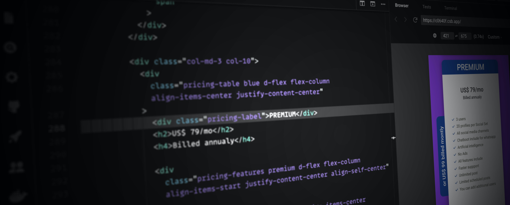

  

 

<h1 align="center">Hi 👋🏼, I'm Nahum Ramirez</h1>

Front-end and UI developer👨🏽‍💻 specializing in creating visually appealing and user-friendly web interfaces. Committed to clean code and innovative solutions.

<!-- 
  
 -->

 

<h2 align="center">🛠️ Languages I use</h2>

  
  
  
  
  
  
  
  
  
  
  
  
  
  
  
  
  
  
  
  
  
  
  
  
  
  
  
  
  
  
  
  
  
  
  
  
  
  
  
  
  
  
  
  
  
  
  
  
  
  
  
  
  
  
  
  
  
  
  
  
  

###
 

<h2 align="center">📫 Connect with me</h2>

  
  
  
  
   
  
  
  

###

 
<h2 align="center">📊 Github Stats</h2>

 
<h2 align="center">More About me👨🏽‍💻</h2>

  
- 👨‍💻 All of my projects are available at [nermportfolio.vercel.app](nermportfolio.vercel.app)

- 💬 Ask me about **JavaScript, Angular, React, UI/UX**

- 📫 How to reach me **nerm.frontend@gmail.com**

